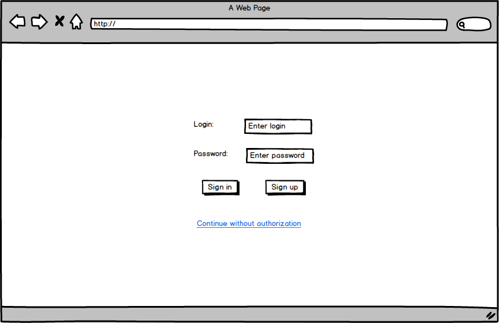

# Требования к проекту
---
# Содержание

<a name="intro"/>

# 1 Введение

<a name="appointment"/>

## 1.1 Назначение
В этом документе описаны функциональные и нефункциональные требования к веб-приложению «Smoker's paradise». Данный проект содержит необходимую функциональность для поиска нужной информации о марках разных сигарет, их особенностях, а также их достоинствах и недостатках.

<a name="business_requirements"/>

## 1.2 Бизнес-требования

<a name="initial_data"/>

### 1.2.1 Исходные данные
На сегодняшний день начинающим курильщикам становится все сложнее и сложнее решить с какой же марки сигарет им начать этот скользкий и опасный путь. Для этих целей, а именно для помощи с выбором и созздается данное приложение.

<a name="business_opportunities"/>

### 1.2.2 Возможности бизнеса
Многие современные курильщики желают иметь сайт, который позволит получать ифнормацию с любого удобного им устройства, поддерживающего браузер. Максимально понятный и удобный интерфейс позволит увеличить число посетителей сайта.

<a name="project_boundary"/>

### 1.2.3 Границы проекта
Сайт позволит пользователям просматривать гайды и делиться своим мнением. Для анонимных пользователей предусмотрена возможность обычного просмотра гайдов.

<a name="user_requirements"/>

# 2 Пользовательские требования

<a name="software_interfaces"/>

## 2.1 Программные интерфейсы
Приложение разрабатывается на платформе Java.

<a name="user_interface"/>

### 2.2 Интерфейс пользователя

- Стартовая страница

  
  
- Страница регистрации

    
  

- Меню гостя

  

### 2.2 Характеристики пользователей

#### 2.2.1 Классы пользователей

| Класс пользователей | Описание |
|:---|:---|
| Гость | Пользователи, которые могут искать информацию о сигаретах, но не имeют право её изменять. |
| Администратор | Пользователь, который может управлять всеми данными на сайте(добавлять гайды и т.д.). |

#### 2.2.2 Аудитория приложения

Любой человек, который хочет побольше о разных видах сигаретных марок.
 
# 3 Системные требования

## 3.1 Функциональные требования
 
### 3.1.1 Управление данными на сайте

#### 3.1.1.1 Добавление гайдов

Администратор имеет право добавлять гайды.
 
#### 3.1.1.2 Удаление гайдов

Администратор имеет право удалять гайды.
 
#### 3.1.1.3 Изменение информации в гайдах

Администратор имеет право изменить информацию в уже созданном гайде.
 
### 3.1.2 Вход администрации

Пользователь при помощи определенного ключа (логин (email или особое имя) и пароль) может войти в режиме администратора.
 
### 3.1.3 Выход администрации 

Администратор имеет возможность выйти из режима администрации.
 
### 3.1.4 Поиск по сайту

Любой пользователь может производить поиск по названию марки сигарет.

## 3.2 Нефункциональные требования

### 3.2.1 Требования к удобству использования

1. Все элементы должны быть светлыми;
2. Все функциональные элементы пользовательского интерфейса имеют названия, описывающие действие, которое произойдет при выборе элемента.

### 3.2.2 Требования к безопасности

1. Добавлять, удалять и изменять информацию может только администратор.

### 3.2.3 Внешние интерфейсы

1. Размер шрифта не менее 12 пт.
