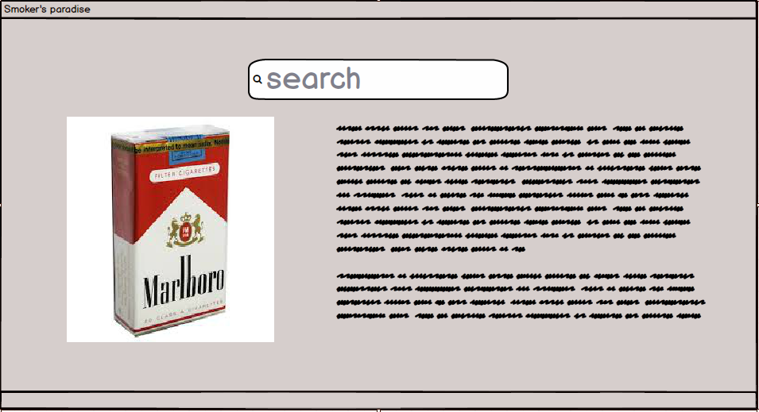

# Требования к проекту
---
# Содержание

# 1 Введение

В этом документе описаны функциональные и нефункциональные требования к веб-приложению «Smoker's paradise». Данный проект содержит необходимую функциональность для поиска нужной информации о марках разных сигарет, их особенностях, а также их достоинствах и недостатках.

# 2 Пользовательские требования

### 2.1 Интерфейс пользователя

- Стартовая страница

  

### 2.2 Характеристики пользователей

#### 2.2.1 Классы пользователей

| Класс пользователей | Описание |
|:---|:---|
| Гость | Пользователи, которые могут искать информацию о сигаретах, но не имeют право её изменять. |
| Администратор | Пользователь, который может управлять всеми данными на сайте(добавлять гайды и т.д.). |

#### 2.2.2 Аудитория приложения

Любой человек, который хочет побольше о разных видах сигаретных марок.
 
# 3 Системные требования

## 3.1 Функциональные требования
 
### 3.1.1 Управление данными на сайте

#### 3.1.1.1 Добавление гайдов

Администратор имеет право добавлять гайды.
 
#### 3.1.1.2 Удаление гайдов

Администратор имеет право удалять гайды.
 
#### 3.1.1.3 Изменение информации в гайдах

Администратор имеет право изменить информацию в уже созданном гайде.
 
### 3.1.2 Вход администрации

Пользователь при помощи определенного ключа (логин (email или особое имя) и пароль) может войти в режиме администратора.
 
### 3.1.3 Выход администрации 

Администратор имеет возможность выйти из режима администрации.
 
### 3.1.4 Поиск по сайту

Любой пользователь может производить поиск по названию марки сигарет.

## 3.1 Функциональные требования

## 3.2 Нефункциональные требования
